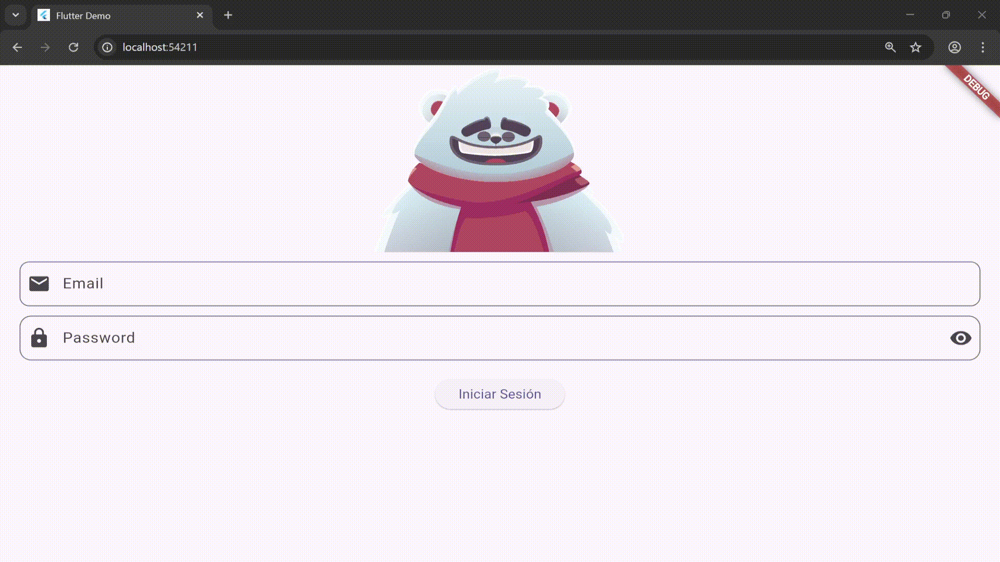

# 🐻 Animated Login Screen with Rive & Flutter

<p align="center">
  
</p>

---

## 📚 Course Information
- **Student:** Carolina Maribel Fernandez Uicab
- **Subject:** Graficación  
- **Professor:** Rodrigo Fidel Gaxiola Sosa  
- **Group:** 5SA  
- **Year:** 2026  

---

## 🚀 Project Description

This project is an interactive login screen developed using Flutter and enhanced with a Rive animated character.

Instead of using static UI components, this application integrates a vector-based animation controlled by a State Machine. The character reacts dynamically to user interactions such as focusing input fields, typing text, and triggering login validation.

The goal of this project is to demonstrate how modern UI animation can be connected to real-time logic using Flutter and Rive.

---

## ✨ Main Features

- 📧 Email input field
- 🔐 Password input field with visibility toggle
- 👀 Bear follows the email text while typing
- 🙈 Bear covers its eyes when password field is focused
- 🎯 Success animation trigger
- ❌ Fail animation trigger
- 🔄 Real-time animation updates using FocusNodes
- 🧠 Proper lifecycle management with `dispose()` to prevent memory leaks

---

## 🎨 What is Rive?

Rive is a real-time interactive animation platform that allows designers and developers to create vector animations with built-in logic.

Unlike traditional GIFs or videos, Rive animations can respond dynamically to user input through programmable parameters called State Machine Inputs (SMI).

Rive enables high-performance animations that run directly inside Flutter applications.

Learn more: https://rive.app/

---

## 🔁 What is a State Machine?

A State Machine is a logic system that defines:

- Different animation states (Idle, Checking, Hands Up, Success, Fail)
- Transitions between those states
- Conditions that trigger each transition

In this project, the State Machine works as the “brain” of the bear animation.

Flutter communicates with the animation using SMI inputs such as:

- `isChecking`
- `isHandsUp`
- `trigSuccess`
- `trigFail`

These inputs allow the animation to react to user focus and typing events in real time.

---

## 🛠 Technologies Used

- 💙 Flutter
- 🎯 Dart
- 🎨 Rive (State Machine)
- 🖥 Visual Studio Code
- 📁 Git & GitHub
- 📱 Android Emulator

---

## 📂 Basic Project Structure

```
lib/
 ├── main.dart
 ├── screens/
 │     └── login_screen.dart
assets/
 └── animated_login_bear.riv
pubspec.yaml
```

---

## 📌 Main Files Explanation

- **main.dart** → Application entry point  
- **login_screen.dart** → UI layout, animation logic, FocusNodes, StateMachineController  
- **assets/** → Contains the `.riv` animation file  
- **pubspec.yaml** → Manages dependencies and registers assets  

---

## 🧠 Animation Logic Implementation

- Implemented using `StatefulWidget`
- Connected to Rive State Machine ("Login Machine")
- Used `StateMachineController` for animation control
- Implemented `FocusNode` listeners inside `initState()`
- Connected focus events to SMI inputs
- Released resources properly using `dispose()` to avoid memory leaks

---

## 🎥 Demo

The animation reacts dynamically to:

- Email typing
- Password focus
- Login result triggers

(Replace `assets/demo.gif` with your actual GIF file.)

---

## 🙌 Animation Credits

Animation obtained from Rive Marketplace:

**Remix of Login Machine**  
https://rive.app/marketplace/3645-7621-remix-of-login-machine/

All rights and credit belong to the original creator on Rive Marketplace.

---

## 📦 Installation

1. Clone the repository
2. Run:

```
flutter pub get
flutter run
```

Make sure Flutter SDK and Android Studio are properly configured.

---

## 🎯 Learning Outcomes

This project demonstrates:

- Flutter UI development
- Integration of vector animations with State Machines
- Event-driven animation control
- Focus management using FocusNodes
- Lifecycle management in Flutter
- Professional documentation using README

---

## 👨‍💻 Author

Developed individually for the **Graficación** course – 2026.

---

⭐ Thank you for reviewing this project!